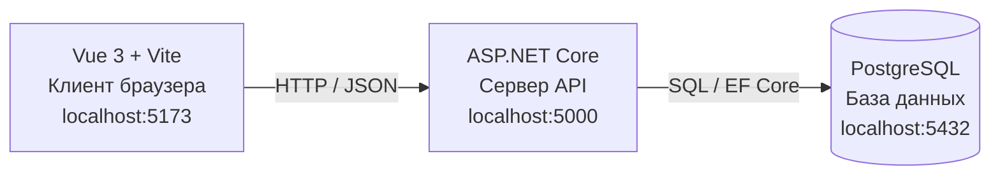
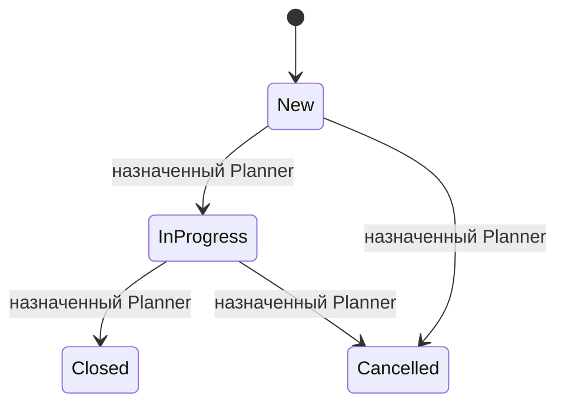

# Архитектура системы

## 1. Назначение

Разрабатываемая информационная система предназначена для планирования графика отпусков работников ОАО «РЖД» и расчёта явочной численности. В рамках текущего учебного проекта реализуется MVP для работы с заявками на планирование отпусков: создание, просмотр, назначение ответственного и изменение статуса. Система не заменяет кадровые решения и не подключается к промышленным системам предприятия.

## 2. Архитектурный подход

Система построена по клиент-серверной трёхзвенной архитектуре. Браузер отвечает за отображение интерфейса, сервер обрабатывает запросы и проверяет бизнес-правила, PostgreSQL хранит данные. Единственным источником актуальных данных о заявках является серверная база данных.



**Это и есть архитектура web-ИС семестра**: три узла, две связи и один источник правды о заявках. Браузер не подключается к PostgreSQL напрямую.

## 3. Компоненты системы

| Компонент | Технология | Ответственность |
|---|---|---|
| Клиентское приложение | Vue 3, Vite | Отображение экранов, формы и таблицы, отправка HTTP-запросов |
| Серверное приложение | ASP.NET Core | REST API, проверка входных данных, ролей и бизнес-правил |
| Хранилище | PostgreSQL | Постоянное хранение заявок, участков и пользователей |
| Обмен данными | HTTP, JSON | Передача запросов и ответов между клиентом и сервером |

## 4. Взаимодействие компонентов

1. Пользователь выполняет действие в интерфейсе Vue.
2. Клиент отправляет HTTP-запрос на сервер ASP.NET Core.
3. Сервер проверяет данные запроса, существование связанных записей и права пользователя.
4. При успешной проверке сервер обращается к PostgreSQL, получает или изменяет данные.
5. Сервер возвращает клиенту JSON и HTTP-код результата.
6. Vue обновляет отображаемые данные.

Пример запроса создания заявки:

```http
POST http://localhost:5000/api/vacation-requests
Content-Type: application/json
```

```json
{
  "title": "Планирование отпусков участка связи",
  "siteId": 2,
  "description": "Подготовить проект графика отпусков работников участка."
}
```

Сервер самостоятельно формирует `id`, `number`, начальный статус `New`, дату создания и автора по текущему пользователю. Клиент не должен передавать эти поля при создании.

## 5. Роли и доступ

| Роль | Возможности в рамках MVP |
|---|---|
| `HRSpecialist` — кадровый специалист | Создаёт и просматривает заявки, назначает ответственного |
| `Planner` — ответственный за планирование | Просматривает назначенные ему заявки, переводит свою заявку в работу и завершает или отменяет её |
| `Manager` — руководитель | Просматривает сводную информацию без изменения заявок |

Проверка полномочий выполняется на сервере. Скрытие кнопки в интерфейсе не считается достаточной защитой. Изменять статус заявки может только назначенный на неё ответственный с ролью `Planner`.

## 6. Статусы и переходы

В базе данных и API используются неизменные коды статусов. Русские названия применяются только для отображения.

| Код | Отображаемое название | Значение |
|---|---|---|
| `New` | Новая | Заявка создана, работа ещё не начата |
| `InProgress` | В работе | Ответственный приступил к обработке |
| `Closed` | Завершена | Работа по заявке закончена |
| `Cancelled` | Отменена | Заявка отменена, запись сохраняется |



Переходы выполняются через отдельный запрос изменения статуса. Удаление заявки не предусматривается: отмена фиксируется статусом `Cancelled`.

## 7. Границы MVP

В проект входят создание и просмотр заявок, назначение ответственного, изменение статусов, разграничение доступа по ролям, хранение данных в PostgreSQL и базовые рекомендации по планированию.

В проект не входят реальные интеграции с информационными системами РЖД, обработка реальных персональных данных, интеграция с 1С, SMS-уведомления, автономное принятие кадровых решений, промышленная ИИ-модель, расчёт заработной платы и юридическое оформление отпусков.

## 8. Условия запуска

Для локальной разработки используются следующие адреса:

| Узел | Адрес |
|---|---|
| Vue-клиент | `http://localhost:5173` |
| ASP.NET Core API | `http://localhost:5000` |
| PostgreSQL | `localhost:5432` |

Порядок запуска и необходимые команды должны быть указаны в корневом `README.md` репозитория. Конкретные команды зависят от текущей конфигурации проекта.
