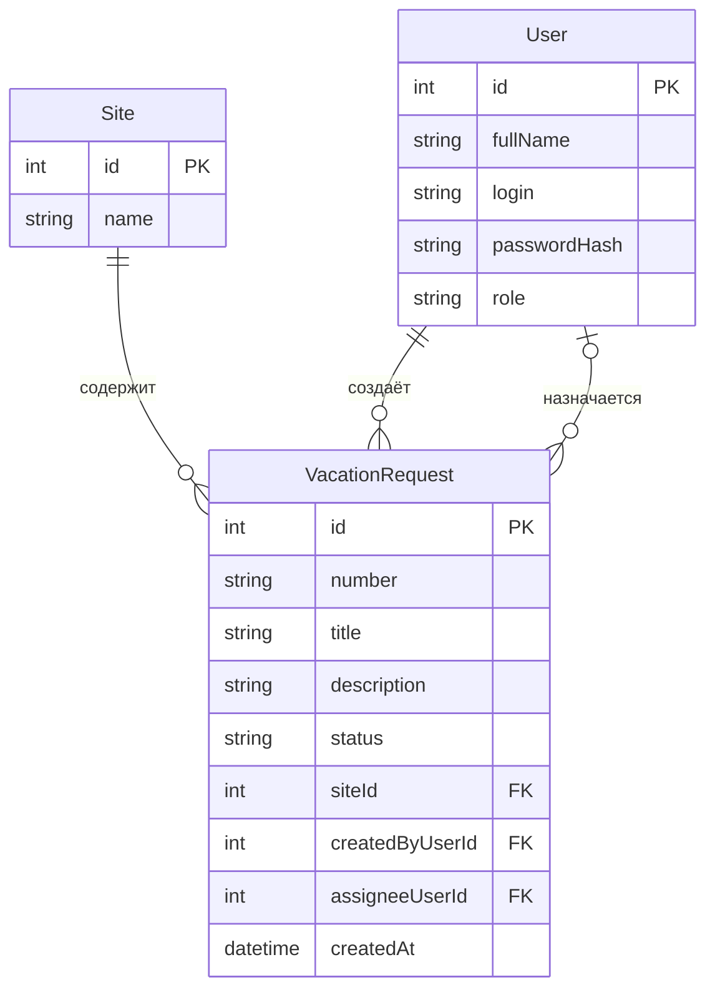

# Модель данных

## 1. Общие сведения

Для хранения информации используются три основные сущности: `VacationRequest` (заявка на планирование отпуска), `Site` (участок предприятия) и `User` (пользователь системы). Каждая сущность хранится в отдельной таблице и имеет первичный ключ `id`.

`id` используется системой для однозначной идентификации записи. Поле `number` — отдельный человекочитаемый номер заявки. Эти значения не взаимозаменяемы.

## 2. Сущности и атрибуты

### 2.1. VacationRequest — заявка на планирование отпуска

| Поле | Тип | Ключ / обязательность | Назначение |
|---|---|---|---|
| `id` | integer | PK, обязательно | Уникальный технический идентификатор |
| `number` | string | обязательно, уникальный | Человекочитаемый номер заявки |
| `title` | string | обязательно, 5–80 символов | Краткое название заявки |
| `description` | string | обязательно, 10–500 символов | Описание задачи |
| `status` | string | обязательно | Код текущего статуса |
| `siteId` | integer | FK → `Site.id`, обязательно | Участок, к которому относится заявка |
| `createdByUserId` | integer | FK → `User.id`, обязательно | Пользователь, создавший заявку |
| `assigneeUserId` | integer | FK → `User.id`, допускает NULL | Назначенный ответственный |
| `createdAt` | datetime | обязательно | Дата и время создания |

`id`, `number`, `status`, `createdByUserId` и `createdAt` назначаются сервером. При создании клиент передаёт `title`, `siteId` и `description`. До назначения ответственного `assigneeUserId` имеет значение `NULL`.

### 2.2. Site — участок предприятия

| Поле | Тип | Ключ / обязательность | Назначение |
|---|---|---|---|
| `id` | integer | PK, обязательно | Уникальный идентификатор участка |
| `name` | string | обязательно, уникальность рекомендуется | Наименование участка |

Наименование участка хранится в справочнике `Site`, а в заявке сохраняется только ссылка `siteId`.

### 2.3. User — пользователь системы

| Поле | Тип | Ключ / обязательность | Назначение |
|---|---|---|---|
| `id` | integer | PK, обязательно | Уникальный идентификатор пользователя |
| `fullName` | string | обязательно | Имя пользователя для отображения |
| `login` | string | обязательно, уникальный | Учётное имя пользователя |
| `passwordHash` | string | обязательно | Хеш пароля, не исходный пароль |
| `role` | string | обязательно | Роль пользователя |

Дополнительные поля `fullName`, `login`, `passwordHash` и `role` уточняют модель пользователя для учебного приложения. Пароль в открытом виде не хранится.

## 3. Диаграмма сущность–связь (ER)

## 4. Связи между сущностями

| Связь | Тип | Описание |
|---|---|---|
| `Site` — `VacationRequest` | Один ко многим (1:N) | Один участок может иметь несколько заявок. Каждая заявка относится к одному участку |
| `User` — `VacationRequest` через `createdByUserId` | Один ко многим (1:N) | Один пользователь может создать несколько заявок. У каждой заявки один автор |
| `User` — `VacationRequest` через `assigneeUserId` | Один ко многим (1:N), назначение необязательное | Один пользователь может быть ответственным по нескольким заявкам. У заявки может не быть ответственного либо быть один |

## 5. Проверка третьей нормальной формы (3НФ)

Название участка не дублируется в каждой заявке. В таблице `VacationRequest` хранится только `siteId`, а само название находится в таблице `Site`. Аналогично, сведения о пользователе не копируются в заявку: автор и ответственный задаются внешними ключами на `User`.

Таким образом, данные об участке и пользователе хранятся в своих сущностях, что снижает дублирование и позволяет обновлять справочную информацию в одном месте. Это соответствует применяемому в работе принципу 3НФ: атрибуты описывают свою сущность, а связанные сущности соединяются ключами.

## 6. Ограничения и правила целостности

- `VacationRequest.id`, `Site.id` и `User.id` являются первичными ключами.
- `VacationRequest.number` уникален и формируется сервером.
- `siteId` и `createdByUserId` обязательны и должны ссылаться на существующие записи.
- `assigneeUserId` может быть пустым; если он заполнен, он должен ссылаться на существующего пользователя с ролью `Planner`.
- Допустимые значения `status`: `New`, `InProgress`, `Closed`, `Cancelled`.
- Ограничения длины `title` и `description` проверяются сервером.
- Отмена не удаляет запись из базы данных.
